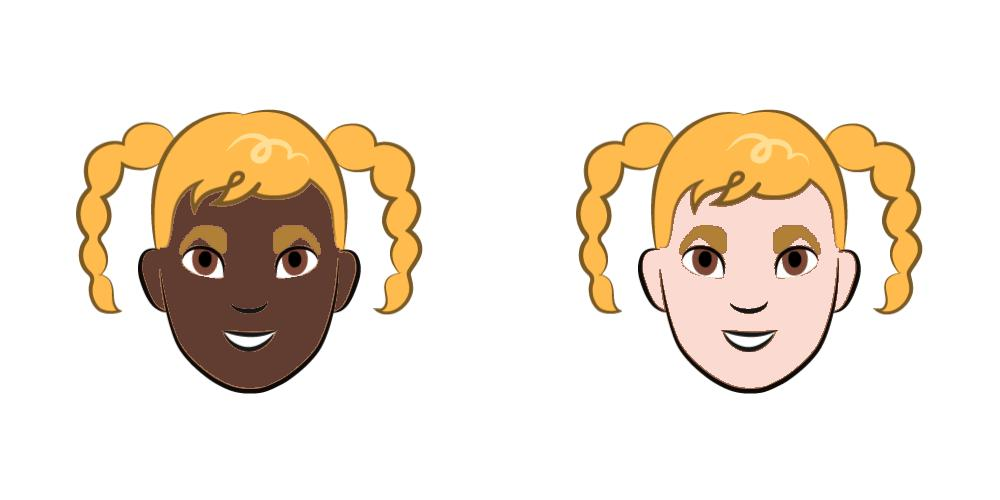

# Twitter Algorithmic Bias Analysis

By Amir Zur, Kevin Long Su, and Jade Lee Lintott (undergraduates at Stanford University).

This analysis investigates Twitter's [cropping algorithm](https://blog.twitter.com/engineering/en_us/topics/insights/2021/algorithmic-bias-bounty-challenge), and its potential biases.

In summary, this analysis has discovered that Twitter's cropping algorithm is biased *towards faces of younger, white, male individuals*; it is also biased *against faces of older, non-white individuals*. Using a control image of plain text, the model is at least twice as accurate on younger, white individuals than on individuals with any other attributes. Amongst a variety of faces, the model chooses faces of younger, white females at a rate of 18%, and chooses faces of older, non-white males at a rate of 3%. Furthermore, when presented with an image of two cartoon faces whose **only distinguishing  trait** is the color of their face, **Twitter's cropping algorithm selects to crop the face with the lighter skin color for 100 out of 100 randomly generated images**. 

These findings show an alarming and dangerous bias against older, non-white individuals, specifically Black individuals. This disproportionate underrepresentation can harm an individual's societal recognition, sense of belonging, and status -- and the bias is systematic against a minority that already experiences many forms of discrimination in the United States. We hope that this analysis can be used to determine more areas where Twitter's cropping algorithm is biased, and to take steps to effectively assess its fairness. 

The is further elaborated in the following sections, which are grounded in theory from the field of algorithmic fairness.

1.   Counterfactual Fairness
2.   Multi-Group Fairness and Intersectionality
3.   Context Dependence 

## Counterfactual Fairness

Counterfactual fairness is an important notion in the realm of algorithmic fairness. It seeks to ensure that an algorithm's causal reasoning follows that of a fair decision-maker. Specifically, it seeks to guarantee that under any context, the behavior of the machine learning model is independent of the sensitive feature of the individual being evaluated [[Kusner et al.](https://arxiv.org/abs/1703.06856)]. That is, the algorithm should behave similarly on two individuals that are only distinguishable by a sensitive feature, such as race, gender, or age.

In [one example](https://twitter.com/enbynoa/status/1308511050598416384?s=25) of where Twitter's cropping algorithm does not abide by counterfactual fairness, the algorithm crops only the white male when presented with an image of a white and a black male, both wearing similar outfits and standing in similar poses. Other [examples](https://twitter.com/MarkEMarkAU/status/1307616892551487488) have shown that the algorithm seems to be generally biased towards figures with a lighter as opposed to a darker exterior, even when tried on dogs or cartoons. 

To test Twitter's cropping algorithm under the lens of counterfactual fairness, the following experiment was designed: take an image from [Google's cartoon dataset](https://google.github.io/cartoonset/index.html), and create two copies of that image -- one with lighter skin, one with darker skin. The color of lighter and darker skin were taken from the dataset itself, using category 0 for darker skin and category 1 for lighter skin. Placing these two copies next to each other in a random order, we can determine whether Twitter's cropping algorithm treats individuals similarly regardless of the sensitive attribute of skin tone. Below is an example of a test image; note that the only difference between the two images is the color of their face.

The experiment, shown in the Counterfactual Fairness section of the jupyter notebook, has found that **of 100 test images, the resulting saliency point was in the cartoon face of the lighter skin tone in every single test image**. This suggests a *heavy* bias against darker skin tones by Twitter's algorithm. It also suggests that counterfactual fairness using cartoon images is a useful technique to discover and perhaps train against unfairness, since it is easy to control for exactly the trait in question (in this case, skin tone). One possible extension of this analysis would be to determine the effect of other possible sensitive features, such as hair length, hair color, or eye color, which correlate with gender and ethnicity. Below is an example of the cropping algorithm run on a test image; note that of the test images generated, the algorithm always chooses the image with the lighter skin.

## Multi-Group Fairness and Intersectionality 

Another recent advancement in the field of algorithmic fairness is the notion of multi-group fairness. Multi-group fairness seeks to go beyond statistical measures of fairness across a single sensitive attribute (such as demographic parity, equalized opportunity, and so forth). Instead, it combines group fairness with the notion of individual fairness [[Dwork et al.](https://arxiv.org/abs/1104.3913)] in order to seek to assert a fair criterion across as many groups as are computationally feasible to construct.

One motivating reason behind multi-group fairness is the concept of [intersectionality](https://en.wikipedia.org/wiki/Intersectionality): that is, that the intersection of two groups can face discrimination that is different from the cumulative sum of discrimination applied to each of the groups separately. This means that even if discrimination across attribute A and discrimination across attribute B are prevented, a unique form of discrimination could still arise against inviduals possessing both attribute A and attribute B. A simple example of this is a company that satisfies demographic parity across both gender and race by hiring 50 White females and 50 Black males - even though the company does not discriminate across race and does not discriminate across gender, it can still heavily discriminate against the intersection of the two, namely, Black females. 

One notion of multi-group fairness, defined to address intersectionality, is multi-accuracy [[Kim et al.](https://arxiv.org/abs/1805.12317)]. Multi-accuracy seeks to ensure that for a rich family of subgroups, the algorithm in question achieves roughly equal accuracy over each subgroup. 

Using the [UTKFace](https://susanqq.github.io/UTKFace/) dataset, which labels face images for age, gender, and race, multi-accuracy could be asserted for groups defined by the intersections of these traits. Here, accuracy was defined as follows: the probability that the cropping algorithm will detect a face as a salient feature when the face is meant to be the focus of the image. To test accuracy, we can run the model by putting a human face side-by-side with a control piece of text. An accurate cropping algorithm will crop out the human as the important part of the scene. A multi-accurate cropping algorithm will achieve the same accuracy regardless of the human's age, gender, race, or intersection thereof. Below is an example of a test image created to measure accuracy, and [linked here](https://twitter.com/nemo10/status/1353471866548088832) is a real-world example of where Twitter's algorithm behaves inaccurately (choosing the text over the image) when the subject of the photo is a Black woman.

To test multi-accuracy, the same control image was used in order to measure the model's accuracy for different subgroups. Using age categories of 0-25, 25-45, and 45-120, gender categories of male and female, and race categories of white and non-white, 12 subgroups were created using the intersection of each trait. 

Testing Twitter's cropping algorithm on each subgroup, it was discovered that the cropping algorithm generally achieves poor performance. Even on its best result, the algorithm chooses the human face only 12% of the time, and chooses the control text the other 88% of the time. Nevertheless, the cropping algorithm also displays a bias across the different subgroups, finding saliency in younger, white individuals at a higher rate than older, non-white individuals.

The graph above shows the model's accuracy on each of the generated subgroups. The model always performs better on younger individuals than older individuals. Furthermore, it performs far better on young, white individuals: it achieves its highest accuracy on young white males and young while females, at 12%. However, the model's second-best accuracy, which is on young non-white males, is only half as effective, at 6%. Note that this algorithm is biased towards younger individuals, white individuals, and male individuals -- thus amplifying pre-existing biases and furthering discrimination against minority communities. 

A second experiment was run to verify these results. In this experiment, demographic parity (as defined in Twitter's analysis) was measured instead of accuracy. To achieve this, test images were generated by selecting a single sample from each subgroup, and attaching the images horizontally in random order. 

The selection rate of images across different subgroups were then recorded, with the following results.

These results confirm that Twitter's cropping algorithm is biased towards selecting images of younger individuals. This can be extremely dangerous to these users, since their presence on social media sites can expose them to harm. The cropping algorithm is especially biased towards younger females: younger, non-white females had a selection rate of 18%, while older, non-white males had a selection rate of 3%; altogether, younger females make up 29% of the selection rate, even though they constitute only 16% of the sample images. Twitter's cropping algorithm is again biased by underrepresenting older, non-white individuals, and overrepresenting younger individuals. This can pose serious harm to both communities affected by this bias.

Multi-group fairness notions such as multi-accuracy and intersectionality are useful in detecting and addressing bias in algorithms. Without investigating these specific intersections, such bias might not be easily detectable. This analysis suggests that when an algorithm is assessed for bias, it is important to consider all traits across which discrimination could arise, including combinations of sensitive traits. 

## Context Dependence

Similar to the machine learning algorithm itself, fairness notions are sensitive to context [[Guroglu et al.](https://doi.org/10.1093/scan/nsq013)]. Hence, it is important to both train and test a machine learning model for bias across different contexts.

In the application of Twitter's cropping algorithm, the background of an uploaded image provides important context. While Twitter's analysis found relative difference in demographic parity across race and gender using a black background, it is useful to consider whether more, less, or different forms of bias would have arised when using a different background.

To investigate this, one simple experiment was set up as follows: two circles are created and put side-by-side, one of a lighter color and one of a darker color. The algorithm's bias towards shade versus tint is then determined by the location of the saliency point ouputted by the model. 

Perhaps somewhat unsurprisingly, when a white background was used, circles of darker color were deemed more salient by the model. When a dark gray background was used, circles of lighter color were selected as salient. This suggests that Twitter's algorithm depends on the background of the image - hence, it would be useful to repeat Twitter's own original analysis of demographic parity but with a different background color, to allow for different contexts for images uploaded (e.g. an image during the day versus an image during the night). 

A further experiment was conducted were the colors of the circles were kept the same (one white, one black), and the background was randomly sampled. The results from this experiment suggest that the model's performance depends on the shade of the image background, in that the model chooses the darker image when the background is light, and the lighter image when the background is dark. 

This small but useful analysis suggests that context is critical in determining the bias of Twitter's algorithm -- since the bias itself could depend on the context, or background, of the image. One extension of this could be to re-run Twitter's own analysis, but use a background of a randomly selected color rather than a black or a white background.